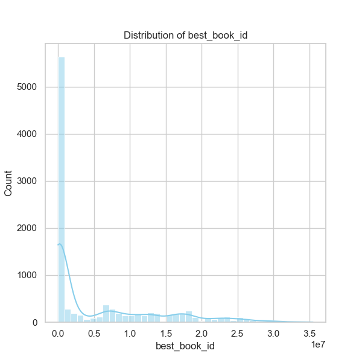
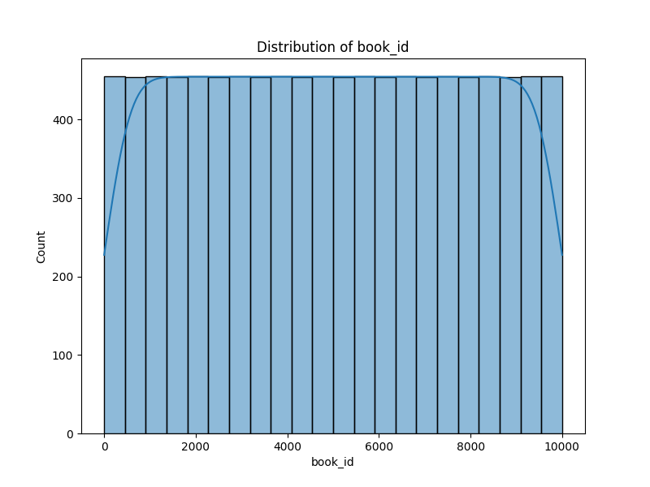
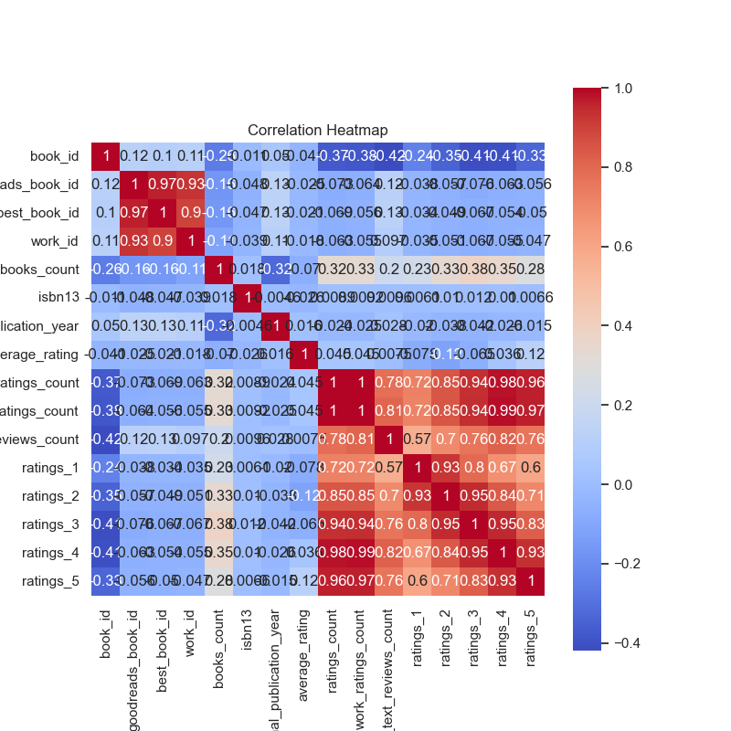
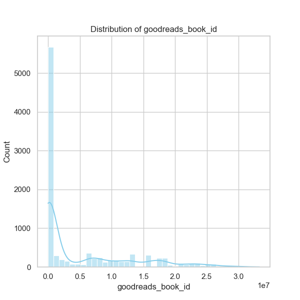

### Narrative on Goodreads Data Analysis

The dataset 'goodreads.csv' encompasses a diverse collection of 10,000 books, capturing critical attributes related to their ratings, authorship, publication years, and more. This analysis aims to explore trends, identify significant patterns, and surface insights relevant for further intellectual inquiries or operational decision-making.

#### Summary Observations

1. **General Population Characteristics**:
   - The dataset reveals a diverse range of books, with a total of 10,000 entries. The median `book_id` of 5000.5 signifies an evenly distributed population.

2. **Ratings and Popularity**:
   - The average rating across books stands at around **4.00**, reflecting a generally favorable reception among readers. The highest individual rating recorded is **4.82**, while the lowest is **2.47**, indicating some books likely outperform in popularity or quality across specific genres or demographics.
   - The ratings count indicates variability in reader engagement, as the average number of ratings is approximately **54,001**, whereas the maximum peaks at **4,780,653**. This suggests potential outliers that could unlawfully skew the understanding of general reader trends. 

3. **Distribution of Ratings**:
   - The distribution of ratings (1-5 stars) reveals significant insights:
     - Ratings of **5 stars** show the highest mean score with nearly **23,790** ratings, indicating high popularity for top-rated books.
     - Ratings of **1 star** are the least represented, showing a mean of just **1,345**, signifying that extremely poor ratings are less common.

4. **Authors and Publication Years**:
   - The dataset includes **4,664 unique authors**, with **Stephen King** being the most prolific, contributing **60 titles**.
   - The average original publication year is approximately **1982**, with titles published from as far back as **1750 to 2017**. This shows a broad timeline of literature represented in the dataset, providing an opportunity to analyze historical reading trends over decades.

5. **Language Codes**:
   - The dataset notes **25 language codes**, with **English (eng)** as the dominant language, accounting for more than **63%** of the books. This could suggest a focus on English literature and possibly limit cross-cultural representation.

#### Insights on Trends and Outliers

1. **High-Performing Books**:
   - Books with higher ratings consistently attract more reviews and ratings. Anomalies include books with an unusually high number of ratings for a modest rating overall.
  
2. **Missing Values**:
   - There are notable missing values in critical attributes like `isbn`, `isbn13`, and the `original_title`. The missing data for `isbn` and `isbn13` suggests potential issues with data entry or source gathering methods which could obscure deeper bibliometric analyses.

3. **Correlations**:
   - There are strong correlations among rating blocks (ratings from 1 to 5), with `ratings_count` displaying the highest correlations with other rating scores. However, it also shows a negative correlation with other fields, such as `average_rating`, suggesting complex reader patterns where higher-rated books may not necessarily receive proportional amounts of more critical ratings, fielding natural biases in reader opinions.
   - Negative correlations with `work_text_reviews_count` imply that books receiving higher ratings often have fewer text reviews, potentially indicating reader apathy towards writing reviews for favored items.

#### Suggested Further Analyses

1. **Clustering**:
   - Implement clustering methodologies (e.g., K-Means or Hierarchical Clustering) on features such as average ratings, ratings counts, and text review counts to identify distinct groups of books. This might help in understanding commonalities among popular books and outliers.
  
2. **Time-Series Analysis**:
   - Perform time-series analysis on the original publication year against ratings and review trends can unveil significant patterns on how tastes have evolved and which eras of literature garner attention over time.

3. **Anomaly Detection**:
   - Utilizing anomaly detection algorithms could help isolate books that do not fit established patterns—such as those with unexpectedly high ratings but low review counts. Identifying why these anomalies exist could yield insights into unique market segmentation.

4. **Sentiment Analysis**:
   - Conduct sentiment analysis on the text reviews to correlate general reader sentiment with numerical ratings, enhancing understanding of qualitative feedback.

#### Future Implications

Understanding these trends is crucial for stakeholders within publishing and marketing realms. Insights gained from the analysis could help in strategic marketing initiatives, cater to emerging reader preferences, refine author engagements, and target acquisitions based on historical data patterns. Moreover, identifying and addressing data quality issues can streamline future analytics endeavors, contributing positively to decision-making processes in book publishing, marketing, or curation on platforms akin to Goodreads.

