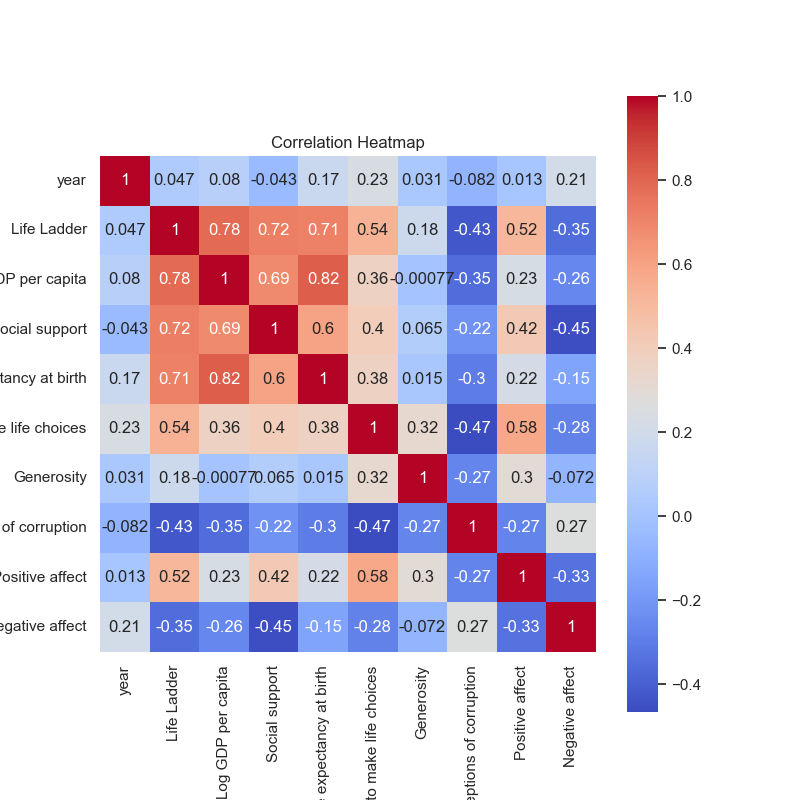
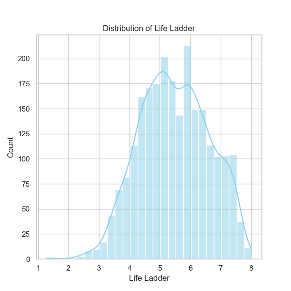
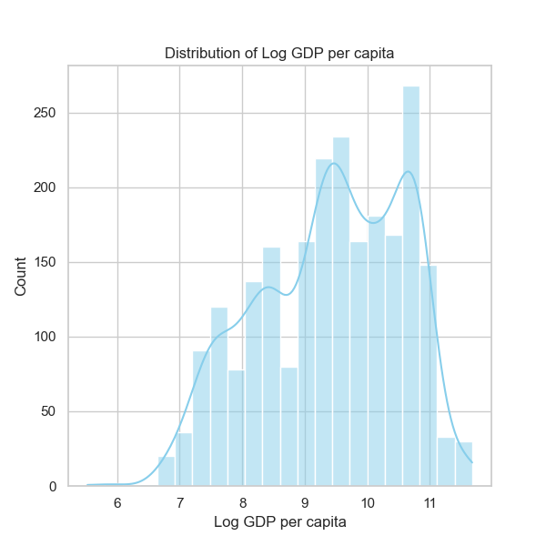
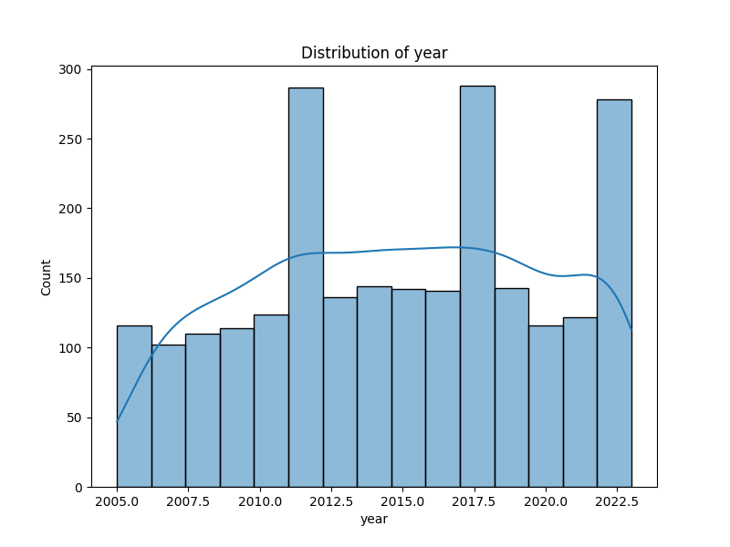

### Narrative of Happiness Data Analysis from 'happiness.csv'

The dataset 'happiness.csv' covers various indicators of happiness across 165 countries from 2005 to 2023. Here's a detailed analysis based on the provided statistics, correlations, and missing values, emphasizing key insights.

#### 1. Overview of the Data
- **Country Coverage**: The dataset includes responses from 165 unique countries with a total of 2363 recorded instances. The most frequently occurring country is Argentina, appearing 18 times.
- **Years Covered**: The dataset spans 19 years, with an average year of approximately 2014.76. The time range illustrates significant periods in global welfare and economic conditions.

#### 2. Summary Statistics
The main variables of interest contain essential metrics that help us evaluate the factors influencing happiness across countries:

##### Life Ladder
- **Mean**: Approximately 5.48, indicating a moderate level of overall happiness across the dataset.
- **Range**: Life Ladder scores range from 1.281 (very low happiness) to 8.019 (high happiness).
- **Outliers**: A notable outlier could be individuals or regions scoring significantly below or above the mean—indicating conditions that merit deeper investigation.

##### Economic Indicators
- **Log GDP per Capita**: The average log GDP per capita is 9.4, suggesting that economic conditions have a tangible role in happiness metrics. A strong positive correlation with the Life Ladder (0.78) indicates that wealthier nations tend to report higher happiness levels.
- **Social Support**: With a mean of 0.81, social support parameters reveal a critical link to happiness. This variable also correlates positively with the Life Ladder, indicating that community and familial ties significantly impact well-being.

##### Health and Well-being
- **Healthy Life Expectancy** found an average of approximately 63.4 years. Given the strong correlation (0.71) with the Life Ladder, health provision and access to healthcare appear crucial for enhancing happiness levels.

##### Freedom and Corruption
- **Freedom to Make Life Choices**: The mean value is around 0.75, and it shows significant positive correlations with Life Ladder (0.54) and Positive Affect (0.58). Countries with higher reported freedoms tend to have higher happiness levels.
- **Perceptions of Corruption** are inversely related to the Life Ladder (correlation of -0.43), indicating that perceived corruption severely impacts societal happiness.

#### 3. Missing Values
- The dataset presents various missing values across critical indicators like Healthy Life Expectancy (63 missing entries) and Generosity (81 missing entries). Proper handling of these missing values is essential prior to any analysis to avoid bias in the results.

#### 4. Correlation Analysis
The correlation matrix reveals significant patterns:
- Strong positive correlations with Life Ladder:
  - **Log GDP per Capita** (0.78)
  - **Social Support** (0.72)
  - **Healthy Life Expectancy** (0.71)
- Negative correlations with:
  - **Perceptions of Corruption** (-0.43)
  - **Negative Affect** (-0.35)

These correlations suggest that socio-economic conditions, health benefits, and counteracting corruption could be fundamental levers for national happiness improvements.

#### 5. Anomalies and Trends
- Trends indicate that as GDP and social support increase, so does the happiness score (Life Ladder). However, certain countries may exhibit high GDP but lower happiness due to issues related to social inequality or corruption.
- There may be patterns over the years to analyze, especially investigating whether nations that improved their economic metrics also saw a corresponding increase in happiness.

#### 6. Suggested Further Analyses
To deepen insights and possible interventions:
- **Clustering Analysis**: By grouping countries based on similarity in Life Ladder and economic indicators, we could identify potential regions that may require focused policy interventions.
- **Time Series Analysis**: Observing trends over years can illustrate whether happiness indicators are improving or deteriorating and help correlate these changes with historical data or major global events (e.g., financial crises, pandemics).
- **Anomaly Detection**: Identifying outlier countries that have unusual happiness scores relative to their economic indicators can foster exploration into local conditions—whether they be cultural, environmental, or political—that impact happiness.

#### 7. Implications for Future Decisions
- Policymakers should focus on enhancing social support structures with community programs, addressing corruption, and ensuring equitable resource distribution.
- There's a pronounced need for initiatives fostering freedom and health access, particularly in lower-scoring nations, which could help elevate their overall happiness levels.
- Continuous monitoring of these indicators will aid in adjusting policies dynamically to uphold or enhance national happiness indices.

In conclusion, the analysis presents a comprehensive view of how economic, social, health, and governance factors interplay to determine global happiness. By leveraging these insights, stakeholders can make informed decisions to promote better life satisfaction across different populace groups.

