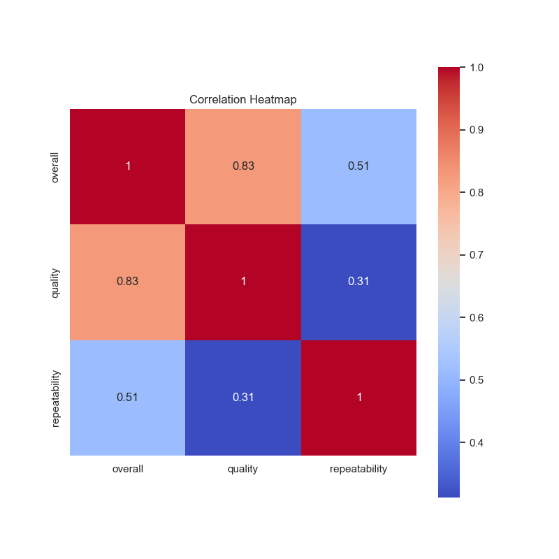
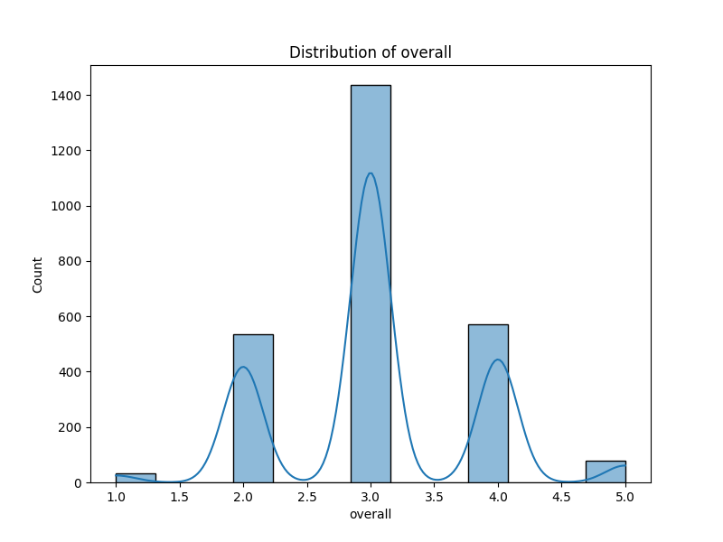
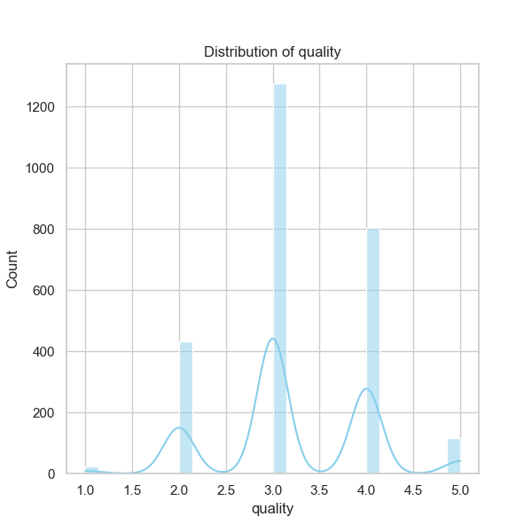
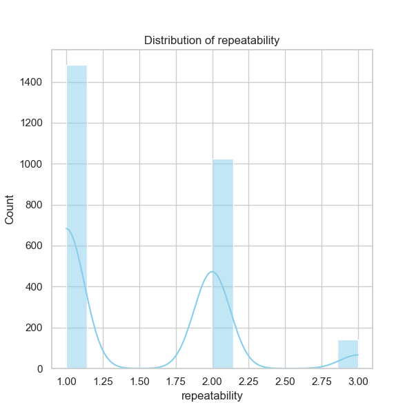

### Data Analysis Narrative for 'media.csv'

The dataset 'media.csv' contains information on various media, encapsulated in columns that highlight specific features such as the date of entry, language, type of media, title, creator, and different metrics such as overall ratings, quality, and repeatability. Here’s an analysis of the key findings based on the summary statistics, missing values, and correlation metrics.

#### Overview of Dataset Characteristics

- **Date**: The dataset includes 2,553 entries corresponding to 2,055 unique dates, with notable frequency on '21-May-06'. This suggests that data entries may have been concentrated around certain periods, perhaps indicating specific media releases or data collection efforts.

- **Language**: There are 11 unique languages, with 'English' being the most prevalent (1,306 occurrences). This dominance may reflect the global reach of English-language media or the focus of the dataset.

- **Media Type**: The type of media is predominantly 'movie' (2,211 entries), suggesting a bias in the dataset towards films over other types such as documentaries or series.

- **Title and Creator**: There are 2,312 unique titles and 1,528 unique creators. Notably, 'Kanda Naal Mudhal' appears frequently (9 times) and the most common creator, Kiefer Sutherland, has 48 entries, indicating that certain titles and individuals significantly contribute to the dataset.

- **Ratings**: The average ratings for overall (3.05), quality (3.21), and repeatability (1.49) suggest a generally positive perception of the media, albeit with a notable mean score for repeatability indicative of lower ratings in this area compared to overall quality.

#### Missing Values

There are missing values for 'date' (99 entries), which could hinder time-series analysis and insights into trends over time. Moreover, missing values for 'by' (262 entries) may limit understanding of creators behind the media listed. Addressing these missing values is crucial for an accurate analysis.

#### Correlation Analysis

The correlation metrics reveal interesting relationships:

- **Overall vs. Quality**: A high positive correlation (0.83) suggests that higher media quality ratings are closely tied to overall ratings. This relationship indicates that improvements in perceived quality could enhance overall ratings, guiding producers towards quality enhancements.

- **Overall vs. Repeatability**: The correlation here is moderate (0.51), indicating that a better overall rating could lead to higher repeatability, but not as strongly as the quality overall relationship. Strategies to enhance media appeal could emphasize familiar themes or beloved content to encourage repeat viewership.

- **Quality vs. Repeatability**: A lower correlation (0.31) indicates that repeatability does not heavily depend on perceived quality. Further investigation into why viewers do not want to rewatch certain high-quality media could yield insights for creators.

#### Trends, Outliers, and Patterns

1. **Temporal Trends**: An analysis over time (especially considering missing date entries) may reveal trends in media consumption or release patterns, such as specific years where a surge in media outputs occurred (potentially represented by the repeated date of '21-May-06).

2. **Creator and Title Focus**: The concentration of titles and creators suggests potential outlier trends, where a few creators dominate the dataset, impacting diversity. This could lead to recommendations for a push toward less recognized creators or novel media to enrich the dataset and avoid homogenization.

3. **Quality and Repeatability Metrics**: The ratings suggest an opportunity to explore why a sizable fraction of media rated high in quality do not translate to repeat viewership. Conducting sentiment analysis on viewer feedback could uncover qualitative insights that drive this disparity.

#### Suggestions for Further Analysis

1. **Cluster Analysis**: Implement clustering techniques (such as K-means or hierarchical clustering) to identify groups of media based on ratings and features. This could assist media producers in understanding distinct audience preferences.

2. **Anomaly Detection**: Anomalies in ratings could be explored further, particularly entries that feature unusually low or high ratings. Techniques like Isolation Forest or DBSCAN may help identify atypical entries, revealing valuable insights.

3. **Time-Series Analysis**: Addressing the missing date values, a time-series analysis could explore trends over the years, understanding the evolution of media perception and consumption.

#### Impact on Future Decisions

Understanding these trends can greatly impact decision-making in media production and marketing. By focusing on high-quality content, exploring the factors that enhance repeatability, and being aware of the concentration of creators, media producers can tailor their strategies to maximize viewer engagement and satisfaction. Investing in data-driven insights can foster diversification and innovation, ultimately enhancing the quality of media offerings and viewer retention.

